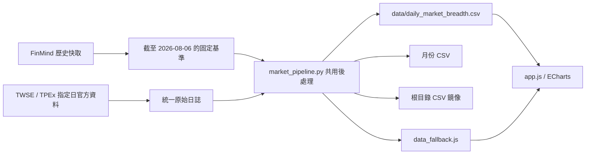

# 台股市場廣度與融資維持率儀表板

這是一個不需要前端編譯工具的靜態網頁專案。網頁由 `index.html`、`styles.css`、`app.js` 與 Apache ECharts 組成，主資料為 `data/daily_market_breadth.csv`。

資料流程已統一為「下載原始資料 → 正規化日誌 → 共用後處理 → 產生所有公開檔案」。正常每日更新與指定日期回補使用完全相同的格式與計算程式，不會再把 FinMind 歷史公式與另一套每日公式直接接在同一份 CSV。

> 儀表板中的融資維持率是市場壓力估算值，不是證券商依個別信用帳戶計算的正式整戶擔保維持率，也不構成投資建議。

## 系統流程



第一次轉換會從既有 FinMind 快取建立：

- `data/market_breadth_baseline.csv`：固定基準日前的處理結果。
- `data/processor_bootstrap.json`：基準日當下每檔股票最近 60 筆收盤狀態。

基準日後，每個正常更新或補漏日期都寫入 `data/raw_market_daily.csv`。處理器每次從固定基準開始，按照日期順序重播原始日誌。因此即使先有 8/10、後來才補進 8/7，8/7 及其後所有日期也會自動重新計算。

## 主要檔案

| 檔案 | 用途 |
| --- | --- |
| `index.html` | 頁面結構、控制按鈕及四個圖表容器。 |
| `styles.css` | 儀表板版面、色彩、圖表高度與響應式樣式。 |
| `app.js` | 讀取 CSV、驗證資料、建立 ECharts 圖表及同步縮放。 |
| `fetch_real_data.py` | 正常每日更新與指定日期補漏的共同入口。 |
| `market_pipeline.py` | 正規化日誌、歷史基準、共用計算、驗證及輸出管理。 |
| `backfill_history.py` | 從 FinMind 分批下載完整歷史快取，完成後交給共用處理器。 |
| `sync_fallback_data.py` | 同步根目錄 CSV 鏡像及 `data_fallback.js`。 |
| `data/daily_market_breadth.csv` | 唯一主資料表，也是網頁第一順位讀取來源。 |
| `data/raw_market_daily.csv` | 基準日之後的 TWSE／TPEx 正規化逐日原始資料。 |
| `data/raw_market_totals.csv` | 後處理使用的每日市場融資金額。 |
| `data/market_breadth_baseline.csv` | 一次性處理完成的歷史基準。 |
| `data/processor_bootstrap.json` | 由歷史快取濃縮出的 60 日移動狀態。 |
| `data/processing_manifest.json` | 計算版本、最新日期、筆數及原始資料完整度。 |
| `data_fallback.js` | 主 CSV 的 JavaScript 內嵌副本，供 `file://` 開啟。 |
| `.github/workflows/daily_update.yml` | 平日盤後抓取、重算、Git 提交及推送；不直接執行 GitHub Pages 部署。 |

根目錄的 `daily_market_breadth.csv` 現在是主 CSV 的相容性鏡像，欄位與內容必須完全一致。`data.json` 與 `data_fetcher.py` 是舊的模擬資料工具，現行網頁不會載入。

## 統一原始格式

`data/raw_market_daily.csv` 的每列代表某交易日的一檔證券：

| 欄位 | 說明 |
| --- | --- |
| `date` | 交易日，格式為 `YYYY-MM-DD`。 |
| `stock_id` | 四碼證券代號；`TAIEX` 代表加權指數。 |
| `market` | `twse`、`tpex` 或 `index`。 |
| `close` | 當日收盤價。 |
| `margin_balance` | 當日融資餘額。 |

同一日期再次下載時採取「整日取代」而不是重複追加。寫入前必須通過：

1. TWSE 收盤、TWSE 融資、TPEx 收盤、TPEx 融資四個回應日期完全一致。
2. TWSE 及 TPEx 各自達到最低資料筆數。
3. 收盤價與融資餘額有效筆數達到完整性門檻。
4. FinMind 已提供該日市場融資金額。

任一條件不成立，程式會以非零狀態結束，不產生新的公開圖表列。

## 共用計算方式

歷史基準與每日資料都由 `market_pipeline.py` 計算：

- 20MA、60MA：由每檔股票實際收盤歷史計算。
- 市場廣度：計算收盤價高於各自 20MA／60MA 的股票比例。
- 低維持率家數：使用同一個市場壓力代理值：

```text
估算維持率 = 當日收盤價 ÷ 20MA × 166.6
```

- 全市場、上市與上櫃融資維持率延續歷史資料原有的市場價值／融資金額校準尺度，以避免基準與每日資料產生斷層。

這個估算不能還原實際投資人信用帳戶的融資本金、其他擔保品與整戶部位，因此頁面數值應解讀為市場壓力指標。

公開主 CSV 欄位如下：

| 欄位 | 說明 |
| --- | --- |
| `date` | 交易日。 |
| `taiex` | 加權指數。 |
| `maint_130` | 估算值低於 130% 的家數。 |
| `maint_140` | 估算值低於 140% 的家數。 |
| `maint_150` | 估算值低於 150% 的家數。 |
| `maint_160` | 估算值低於 160% 的家數。 |
| `ma20_pct` | 站上 20 日均線比例。 |
| `ma60_pct` | 站上 60 日均線比例。 |
| `total_margin_ratio` | 全市場融資維持率估算。 |
| `twse_margin_ratio` | 上市融資維持率估算。 |
| `tpex_margin_ratio` | 上櫃融資維持率估算。 |

## 本機操作

### 啟動網頁

執行：

```text
啟動網頁儀表板.bat
```

或：

```powershell
python -m http.server 8080
```

再開啟 `http://localhost:8080`。直接雙擊 `index.html` 時會使用 `data_fallback.js`，但 ECharts 仍來自外部 CDN，因此完全離線時可能無法載入圖表函式庫。

### 正常每日更新

執行：

```text
run_daily_update.bat
```

或：

```powershell
python fetch_real_data.py
```

省略日期時，程式先從 TPEx 最新融資資料判定實際交易日，再以該日期抓取四份指定日官方資料。

### 回補漏掉的交易日

例如補回 `2026-08-07`：

```powershell
python fetch_real_data.py --date 2026-08-07
```

指定日期會走與每日更新相同的官方下載、正規化、完整性驗證及後處理。若日誌中已有更晚日期，處理器會自動按日期重播並修正後續結果。

### 只重播原始日誌

資料已下載，只需要重建公開輸出時：

```powershell
python fetch_real_data.py --rebuild-only
```

這個操作只需要已提交的 baseline、bootstrap 與 raw journal，不需要本機 `cache/`，因此可在全新的 GitHub Actions checkout 中執行。

### 重建完整歷史基準

當 FinMind 歷史快取已完整下載，而且確實需要重新處理基準時：

```powershell
python fetch_real_data.py --rebuild-baseline
```

此操作會掃描 `cache/prices/` 與 `cache/margins/`，重新建立 baseline 與 bootstrap，再重播官方原始日誌。第一次可能需要較長時間。

## FinMind 歷史回補

安裝相依套件：

```powershell
python -m pip install requests python-dotenv
```

在不提交 Git 的 `.env` 中設定：

```dotenv
FINMIND_TOKEN=你的_token
```

執行：

```text
補齊歷史數據.bat
```

或：

```powershell
python backfill_history.py
```

程式從 `2024-01-01` 起下載資料至 `cache/prices/`、`cache/margins/`，並在 `cache/progress.json` 保存續傳進度。全部完成後不再使用獨立公式輸出 CSV，而是呼叫 `market_pipeline.py` 重建共同基準。

## 網頁載入方式

1. `index.html` 載入 Google Fonts、`styles.css`、ECharts CDN、`data_fallback.js` 及 `app.js`。
2. `app.js` 優先 fetch `data/daily_market_breadth.csv`，其次才讀根目錄鏡像。
3. fetch URL 會加入時間戳，避免瀏覽器快取舊資料。
4. `file://` 或 fetch 失敗時改用 `window.FALLBACK_CSV`。
5. 只有 `taiex > 0` 且 `total_margin_ratio >= 50` 的資料列會進入圖表。
6. 四張 ECharts 圖透過 `echarts.connect` 共用游標與縮放視角。

## 自動更新與部署

GitHub Actions 在星期一至星期五 UTC 13:45，也就是台灣時間 21:45 執行，並支援手動觸發。

`daily_update.yml` 只負責執行 `fetch_real_data.py`，並在資料有變動時提交及推送 `data/`、根目錄 CSV 與 `data_fallback.js`。baseline、bootstrap 與 raw journal 都位於 `data/`，因此 Actions 不需要未提交且被忽略的本機 `cache/`。

GitHub Pages 使用儲存庫設定中的 `Deploy from a branch`，來源為 `main / (root)`。每日工作流程推送新提交後，GitHub 內建的 `pages build and deployment` 會自動發布網站；`daily_update.yml` 不再重複呼叫 `actions/configure-pages`、`actions/upload-pages-artifact` 或 `actions/deploy-pages`，也不需要 `pages: write` 與 `id-token: write` 權限。這個配置與其他同帳號專案一致，可避免分支部署與自訂 Actions 部署同時存在，造成資料更新成功但每日工作流程被部署工作標記為失敗。

如果未來將 Pages 的 Source 改為 `GitHub Actions`，才需要重新建立自訂部署 job，並為 deployment job 設定 `environment: github-pages`；在目前的分支部署模式下不要加入該 job。

## 輸出保護與檢查

共用處理器會拒絕下列輸出：

- 日期重複或沒有依序遞增。
- 四個門檻家數不是 `130 ≤ 140 ≤ 150 ≤ 160` 的遞增關係。
- TAIEX 小於或等於 0。
- 市場廣度超出 0～100%。
- 維持率估算低於資料完整性門檻。
- 指定日原始資料筆數不足。

處理成功後至少確認：

1. `data/processing_manifest.json` 的 `data_through` 是預期交易日。
2. 主 CSV、根目錄 CSV 與 `data_fallback.js` 內容一致。
3. 月份 CSV 都是相同的 11 欄格式。
4. `node --check app.js` 與 Python 語法檢查通過。
5. 本機頁面的四圖、門檻切換、上市／上櫃切換及縮放連動正常。

本次統一處理完成後（2026-08-11），主 CSV 共 629 筆，最新交易日為 `2026-08-10`；最新估算結果為 `<130%` 3 檔、`<140%` 11 檔、`<150%` 27 檔、`<160%` 187 檔。
